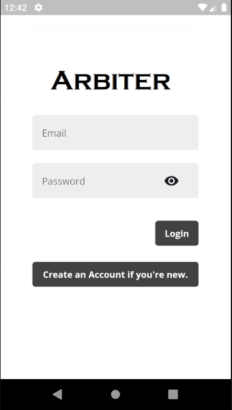

# **Online application for local shopping**

## Description

    The main reason of people coming out of house during lockdown is to buy essentials.if we have a mobile application to buy essential from the local store which can be delivered home by the seller can reduce the spread of Coronavirus and our economy will be maintained in a optimum level.this application have a list of products available at a particular seller, number of units and price details.the buyer platform have the options to buy products.this application contains location filter which enables to buy products from nearby stores. Main idea of this application is to help people to buy essential, reduce spread of covid-19 and maintain better economy level.

## Hardware: 

        Smartphone

## Software

        1. Flutter
        2. Dependecies :
            2.1 http: ^0.12.0+2
            2.2 async: ^2.0.8
            2.3 get_it: ^3.0.0+1
            2.4 provider: ^3.2.0
            2.5 firebase_core: ^0.4.0+9
            2.6 provider_architecture: ^1.0.3
            2.7 firebase_auth: ^0.15.3
            2.8 cloud_firestore: ^0.12.9+5

## Process flow diagram

        

## Data Flow Diagram

    Level Zero diagram__
        

    __Level One diagram__
        

    __Level Two diagram__
        

Final Demo

